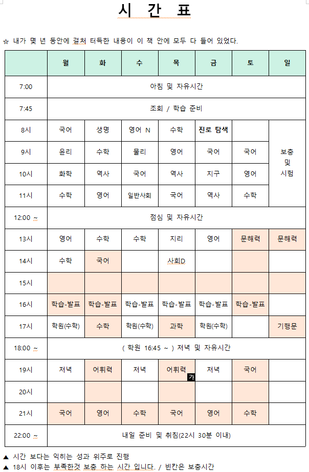

https://github.com/kim-hyun-jin-2008/high-school

```bash
# 다른 컴퓨터에서 작업해 올린것 가져오기
git pull origin master

# Pull  직후 바로 되돌리기
git reset --hard HEAD~1

# 간략하게 한번에 명령 보내기
git add .; git commit -m '변경'; git push origin master

# vscode에서 바로 올리는 방법
```

# 내 목표
1. 매시간 학습결과 마크다운 파일 작성해 올리기
1. 중간시험으로 학습목표 현황 확인하기(중간체크)
1. 시간 철저히 지키기

## 공유문서
<font color='red'>📌 수정/삭제(편집기능) 및 볼 수 있는 권한을 알수 없는 사람(누구나) 가능한 권한으로 중요한 내용은 올리면 절대 안됩니다.</font><br>
&nbsp; &nbsp; - <a href="https://docs.google.com/document/d/1IVXb8VKmlmw0_l-8GnZFF3ZirjNPWK85rdjSCU1SmPU/edit?tab=t.0" target="_blank">구글 DOCS - 공유문서</a>

<hr>

## 학습 시간표


