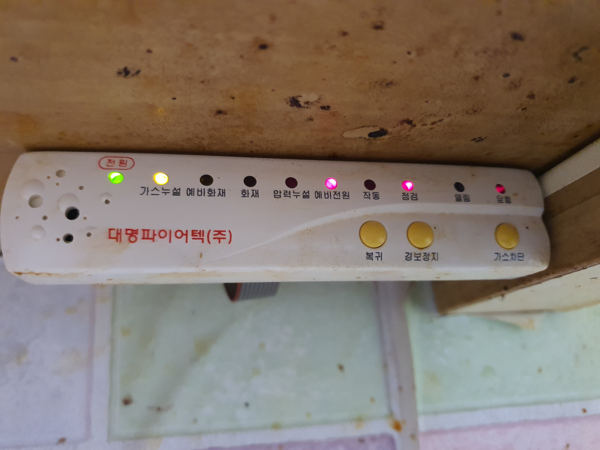

# 가스누설 탐지기

## 대명파이어텍(주)

### 2025.08.14(목)
계속 소리가 나서 아래와 같이 하니 불 빛도 달려졌고 소리도 나지 아니한다.

  * 방법은: 😊케이블을 뺏다가 다시 낌
    - 뺄때 선을 잡아 당기면 절대 아니된다. 다른 모든것(제품)들도 선을 잡아 당기면 절대 안된다.
    - 아래 보면 플라스틱이 보이는데 그것을 잡아 당겨 빼면 되고 방향 그대로 다시 끼우면 된다.

  
  

### 2025.08.12(화)
  - 몇일전 부터 계속 소리가 나거나 간혈적으로 소리가 남.

  - 해본것: '복귀'를 누르고 > 깜박깜박 하더니 계속 소리가 남 > '경보정지'를 누름
    > 😪 이것 소리 난다.

    

