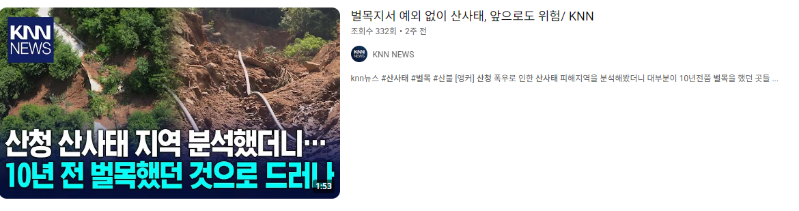

# 뉴스보도 관찰

## 네팔 정권붕괴 - 2025년 9월 둘째주

## 원인
  * 금수저의 자랑질(실제는 그들은 본래 그렇게 살았음)을 SNS에서 많이 올림. 이걸 가난한 사람과 비교 해서 누군가 또 올림
    - 예를 들면 아침밥먹을때, 외출할때, 놀러갈때, ...

  * 사회문제가 되자 .... 이유를 대서 차단을 시킴
    - 문제는 SNS의 무료통화 기능을 이용해 외국에 나가 있는 200만이 넘는 사람들과 통화를 할 수 없음. 국제전화 비용은 너무 비싸 사용안함
    - 부글부글 끓고 있는데 기름을 부워 활활 타오르게 된것
    - 부정부패로 불만이 많은 국민들이 참고 있던것이 터질게 터진것 뿐이다.
    - 겸손에 대해서... 우리 속담에 "벼는 익을 수록 고개를 숙인다" 라는 말이 있다.

## 미련한짓
  * 문제가 발생 했으면 문제의 원인이 무엇인지 핵심 코어를 알아야 한다.
    - 문제 없는것을 건드리면 또 다른 문제가 발생하게 마련이다.

  * 그럼 핵심 코어는 무엇일까?
    - 불만이 생긴것이 SNS 플랫폼 때문인가? 생각해 봐야 하는데 그것이 아니라 실제는 부정부패로 인해 부를 축적한 자들의 행태이다.
      + 윌스미트는 난 어렸을때 동네에서 혼자바보였는데 아들은 전세계인 앞에서 바보네~ 라고 말했다고
    - 힘들게 사는 그리고 실업율이 20%가 넘는 사람들이 가지고 있는 불만에 대한 원인을 타겟으로 해결하려 했어야 했다.
      + 물론 쉽지 않지 그들이 정부고위인사 자재들이거나 사회지도층들 이었으니 쉬운길로 가려다 망한 것이다.
      + 대체로 이래서 문제가 또 발생 한다.

## 이해가 안가는 것
  하지만 이해를 해야 하는것
  * 부탄, 네팔 서구권에서 못살지만 행복한 나라라고 인식하고 국내에서도 부탄에 관해 책도 쓴사람들이 있지
    - 난 이게 이해가 가질 않은것이 보기좋은 풍경. 상부상조 하고 어려운일이 있으면 서로 도와가며 ... 어쩌구 저쩌구 ....
    - 그들이 그 사회속에서 살아보지 않고 잠깐 있었을 터 인데 .... 난 시골에서 살아 보았고 그 속에서 자랐다
    - 정말 이해가 가지 않는것은 잠시 그곳에 가서 휴양을 해도 그곳에서 평생 사는 사람들은 없다는 것이다.
      + 평소 보지 않았던 풍경 고요함 자연과 함께 사는삶 등을 말하지만 지금 삶을 선택하고 있지

  * 서구권에서 행복해 보이는 사람들이 왜? 이런 사태를 일으켰을까 하고 충격이었다는 말을 듣고 나도 충격 이었다.
    - 위에 언급했듯이 그렇게 힘든 삶을 살지 않으면서 몇가지 풍경만 보고 판단 했을것이기 때문이다. 그렇게 좋으면 거기서 살아야지
    - 실제 물리적인 행복이란 무엇인가에 대한 책이 있다.
      + 병원에 얼마나 빨리 가서 치료를 잘 받아 완치 될 수 있는 정도의 사회수준은?
      + 1인이 차지하고 있는 방의 크기는?
      + 의식주 이외의 문화생활은 ... 이런것을 부탄, 네팔인들이 누릴 수 있나? 생각보다 생각이 누군가는 없을 수 있다.

  * 하지만 이런 사람들이 있다는것 그리고 그렇게 생각 한다는것 그리고 돈벌이도 될 수 있다는것
    - 이런것을 인정하고 사는것이 더 행복한? 삶이 될 수 있다.

## 기타
  여러가지 생각이 있을 수 있고 흘러가는 것을 볼 수 있을 텐데... 이런 기록을 잘 정리해 두는 것도 좋은 습관이 되고 나에게 생각할 수 있는 기회가 되어 좋은 방향으로 이끌어 줄 것이다.
  * 한동안 네팔국민들은 힘들텐데 ... 한번 지나가야 되는것이면 괜찮은데.... 그렇지 않으면 쉽지 않을듯
    - 부정부패가 생기는 이유가 있는것이고 누군들 정직하고 깨끗하게 사는것이 좋지 이게 좋겠냐....
    - 우리나라도 이런적이 있었다 그래서 예전 대통령이 공무원의 월급을 대폭 올려 줬지. 최소한 그런것은 하지 못하도록
      + 지금은 민원인에 대해 문자를 보내서 평가하게 하고 ... 여러가지 제도가 있다.
      + 퇴직연금에 대한 문제는 남아있고 본래 월급이 올라가기 전의 기준으로 만들어진 연금제도 인데 월급이 올라간 다음 ... 변경이 안되서

## 이스라엘 - 카타르 도하 공급 - 2025년 9월 둘째주
* 팔레스타인 지도부가 있다고 공급함
  - 주권국가를 무시함
    + 근데 세계대전 이전에는 본래 그랬어 힘있는 나라들이 힘없는 나라 식민지화 하고 그랬음.
    + 현대 사회에서 과거의 형태로 가지 않으리라는 법은 어디에도 없다.
  - 지금 이러니 남도 지키겠지? 라고 생각하면 안된다.

* 이유는?
  - 미국은 오사마빈라덴을 끝까지 추적해서 파키스탄에서 죽였는데. 우리는 왜? 안됨
    + 내가 남에게 피해준것은 생각 하지 않고 남이 나에게 피해준것에 대해서는 응징하고자 하는 것인데..
    + 피는 피를 부른다고 오래전 부터 내려전해 오는 말이 있지. 그렇다고 가만히 있으면 우습게 보기 때문에 안할 수도 없다.

## 산청 수해

* 내가 본것은 어떤 영상인지 정확히 찾을 수 없고 찾고 싶지도 않다
  - 대통령 질문에서 아... 그래요 우리가 일반적으로 생각 하기엔 산불이 났으면 피해가 심할것 같은데 ... 없어요...
  - 이런 질문이 있었다. 산사태 관련해서
  - https://www.youtube.com/results?search_query=%EC%82%B0%EC%B2%AD+%EB%B6%80%EA%B5%B0%EC%88%98

    

  - 내가 하고싶은 말은: 영상을 보면 어떤 기자가 피해가 있는것 처럼 찍은 영상이 있는데 산불난 곳에 대한 명확한 영상은 없다.
    > **영상의 섬네일만 보고 판단하거나 일부만 보고 판단하면 절대 안되며 전체를 모두 확인 하고 판단해야 한다.**

### 하고 싶은 말
비가 많이 왔는데 피해가 없을 수 있나 당연히 피해가 있겠지 중요한것은 산불난 곳이 그렇지 않은곳에 비해 더 피해가 컷느냐에 대한 것인데 그렇지 않다는 것이다.

* 여기서 핵심이 무엇인가?
  - 산불이 비 피해에 어떤 영향을 줬는가 이다.
  - 결론은 그렇지 않다는 것이다. 20년 이상 된 나무가 있는곳에서의 산불은 큰 문제 되지 않는다.
  - 산불이 나지 않았어도 벌목이나 20년 미만의 경우 뿌리가 튼튼하게 아래쪽 까지 뻣지 못해 산사태의 위험이 크다

* 뉴스 보도를 그대로 믿어도 내 인생에 큰 문제가 없는 경우가 많지만
  - 보통 그렇듯이 중요한것 딱 하나만 잘못 걸려도 큰 문제가 생길 수 있어 조심 해야 한다.

  

  

