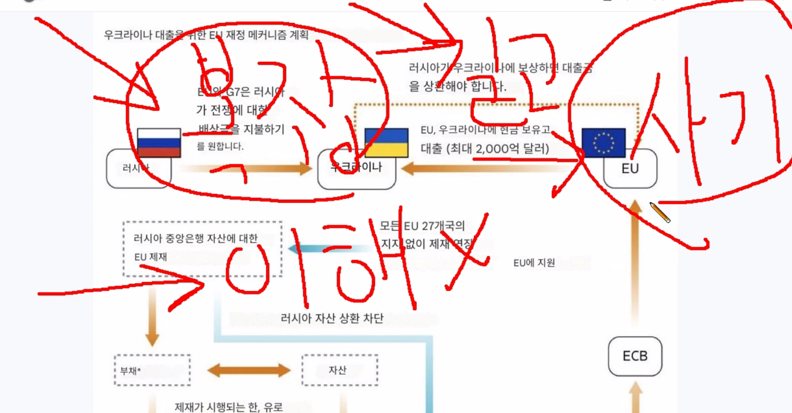

# 사기
여기서 말하는 것은 속이는 것에 대한 것이다.

## 사례3

## 사례2
기술탈취는 어떤 식으로 이루어 질까?

* 내가 직접 경험한 것은 이렇다.
  - 어쩌구 저쩌구 하면서 한번 보자고 하고 어떤 조건을 걸고 그러면서 시간을 질질 끈다.

  - 그리고 내가 이만큼 있으니 당신도 뭔가 걸어야 하지 않나... 뭐 이런다.
    + 난 심리학에 관심이 많아서 이런것 들어주게 하는것에 대해서 대략 알고 있다.
    + 예를 들면 회실에 들어갈때 일부러 문을 열어두고 문좀 닫아 주세요. 하는 명령을 듣게끔 하는 그런것 말이다.
    + 물론 이게 성립이 되려면 타겟이 되는 사람이 가능 늦게 들어오던가 문 근처에 있어야 하는데 생활 하다 보면 이런 경우가 생기겠지.

  - **믿을 수 있게 실력을 하나 보여 달라고 한다.**
    + 빨리 눈치를 채고 손절을 하던가 중요하지 않은 것을 건네야 한다.
    + 대략 이런형태라고 보면 되고 중소기업이 대기업에게 기술이 탈취되는 형태는 별도로 찾아 보면 되는데...
    + 아쉬운쪽에서 스스로 움직이게 하는 근런 형태를 많이 취한다고 보면 된다.
    + 그리고 통상 너무 친절하거나 하면 의심을 더 해봐야 한다.

## 사례1
뭔가 누군가 어떤것을 길게 설명 하는데 복잡하고 이해가 안간다. 간단 명료하게 대답이 가능한것이 보통 그렇다.

* 오래전에 깔끔한 양복에 노란 넥타이를 메고 국내 투자사 모아놓고 칠판에 두시간 동안 열심히 설명하고 이것도 모르냐는 듯이 ...
  - 2000초반에 어떤 사건이 있었는데 정확히는 모르겠네... 고단선생이 예전에 말해준것

* 아래 이미지는 러시아 맞겨 놓은 돈은 쓰고 싶은데 그러면 금융업이 망할것 같으니 이러는 거다.
  - 이건 간단 명료하고 러시아는 오래전 부터 그러면 너희들 기업 러시아에 있는 자산 그 금액만큼 몰수 하겠다고 했다.

  