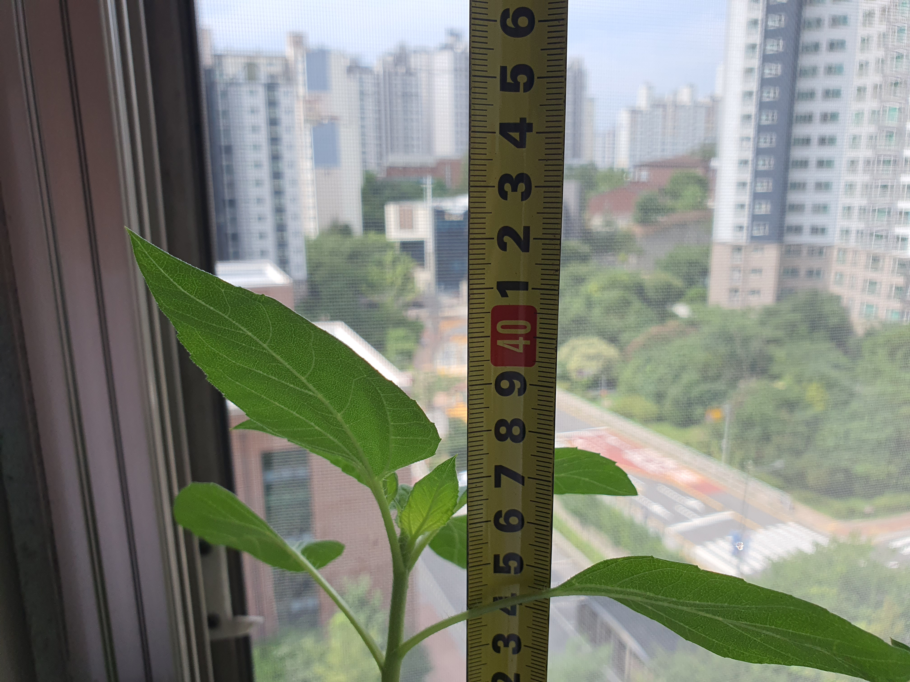
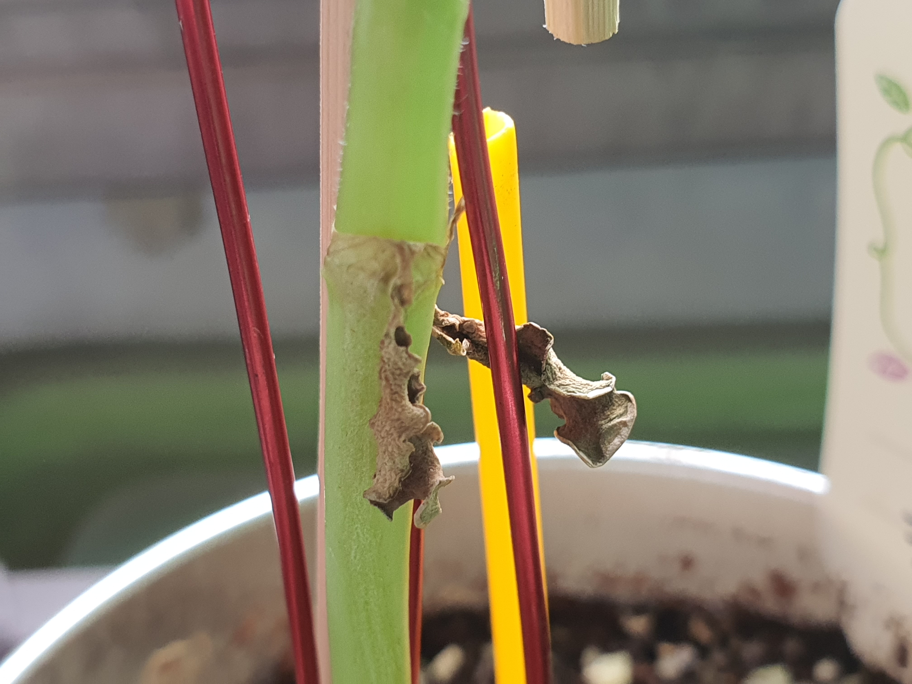
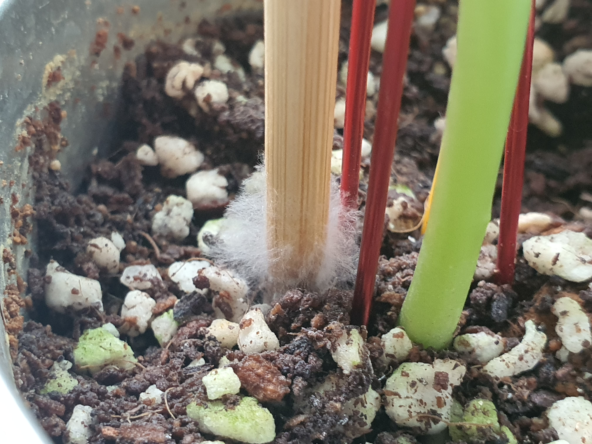
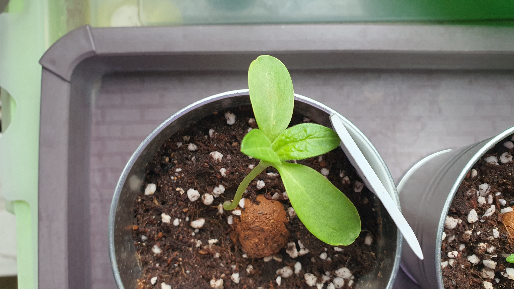

# 미니 해바라기 관찰일지

### 기본 정보
- **관찰자**: 아버지
- **품종**: 미니해바라기
- **파종일**: 2025.06.18

## 성장

### 2025.08.21(목) 맑음
* 하루하루가 다르다 어제찍은 사진과 오늘 아침의 꽃 봉오리는 너무나도 큰 차이가 난다.
  - 두곡이나 줄기가 꺽여 토끼 줄 수 있는 씨앗 까지 잘 자라야 할텐데 ...

  

### 2025.08.20(수) 맑음
* 제대로된 꽃잎이 보이기 시작했다. 꺽인것때문에 걱정 했는데 그래도 꽃은 피울 수 있는 상태로 보인다.

  

### 2025.08.19(화) 맑음
* 엇그제 한번 더 꺽였다. 이번달 초에 꺽인것 말고 그 위쪽으로 한번 더 꺽여서 엇그제 구석으로 옮겨주고 나무에 지탱 시켜 줌
  - 이계 예전에 쓰레기 주어온것 버려야 되는건데 이런 용도로 다 쓰이네~

  
  

### 2025.08.07(목)
* 지난번 꺽인 부분을 자세히 보았는데 버틸 수 있는 정도는 되어 보인다.
  - 자연에서 이상태로 키울 수 없는 상태로 보이고 화분이 작다는것이 느껴진다. 어쩌면 이때문에 줄기가 힘을 없을 수도 있겠다.
  - 처음에 난 아래쪽 잎은 시들어 가는데 이게 자연적인것인지 아니면 떨어진 충격 때문인지는 정확히 모르겠다.

  
  
  
  
  

### 2025.08.06(수)
* 창가에 놓아둔 해바라기가 밤에 비바람에 세차개 불면서 이렇게 되었다.

  

### 2025.07.24(목) 맑음
* 크게 변한것 없이 많이 커서 40cm 까지 자랐다

  

### 2025.07.22(화) 맑음
* 크게 변한것은 없고 날이 어제 오늘 맑어 물을 주었다.

### 2025.07.21(월) 맑음
몇 일 동안의 늦은 장마가 그치고 처음 맞이 하는 맑은 날이다.

* 지지하고 있던 나무젓가락에서 풀어 놓았던것을 다시 지지해 줄 수 밖에 없는 상황이 발생 했다.
  - 너무 휘어져서 그냥 둘 수 없었기 때문임.
* 맨 처음 나온 잎은 완전히 말라 떨어지기 직전

  
  

### 2025.07.19(토) 비
* 맨 아래 처음난 잎이 시들어 말라 버린것을 발견 하였다.
  - 엇 그제 나무젓가락 기둥 건드리면서 잘못 되었을까? 건드린것 같지 않다.
  - 이전 찍어 놓은 사진을 보면 잎이 크지 않고 힘이 없어 보이는데 자연적인 현상이 아닐까 싶다.
  - 이때문에 흙을 만져 보았는데 요즘 계속 비가 온 상태로 물을 주지 않았지만 축축한 상태 였다.

### 2025.07.18(금) 비.
* 줄기가 창가로 약간 기울어진 형태인데 이제 어떻게 되는지 환전히 휘어져 도와주지 않으면 안될때 까지 그대로 둘 생각이다.
* 만들어준 버팀목을 자세히 보니 🍄힌색 곰팡이 꽃이 핀것을 발견 하였다.
  - 나무로 된것이기 때문에 현재 날씨가 흐리고 비가 온것이 가속화를 시켰을 뿐 언제 발생해도 이상하지 않은 현상이라 생각이 든다.
  - 즉, 썩지 않는 다른 버팀목을 선택 했어야 했다.

  

### 2025.07.17(목) 비.
* 보는 기분 탓일까? 햇빛이 없어서 일까? 똑바로 선 모습니다.
  - 아니면 잎에 나무젓가락을 걸쳐 놓은 형태여서 그럴 수 있겠다.

### 2025.07.16(수) 비.
* 나무막대로 지지해줬던 버팀목 형태를 변경 했다.
  - 자연에선 어땠을까. 내가 해준 버팀목 때문에 줄기가 약해진것은 아닐까 하는 생각이 들어서 였다.

### 2025.07.15(화) 아침 비. 구름
* 키가 더 커서 나무젓가락을 하나 추가해서 고정을 해주었다.
  - 얼마나 더 자날까? 화분의 크기가 있으니 엄청 자라긴 힘들것 같은데 그래도 70Cm 정도를 예상해 본다.
  - 초기 키울때 어느정도 자랄지 예상을 한 다음 미리 기둥을 세웠어야 뿌리를 덜 다치게 세울 수 있었을듯 하다

* 잎은 창가를 바라보는 방향인데 특히 2번째 나온 잎이 더 분명해 보인다.
  - 큰 잎이라고 볼 수 있는것을 세어보니 10개 정도 되었다.

### 2025.07.13(일) 맑음.비.구름
* 반듯하지 앞을 더 자세히 찍어 보았다. 점점 펴질듯~

  
  

### 2025.07.12(토) 맑음
* 두번째 난 잎이 많이 아래쪽으로 기울어져서 처음 난 잎 처럼 힘 없이 축 처질까? 하루사이 기운 없어 보인다.
  - 어제 철사로 반듯하게 해준것이 다시 해쪽으로 기울어졌는데 밤사이 키가 더 커서 생긴걸까?
  - 다시 철사로 반듯하게 세워 주었다. 줄기를 보니 반듯하지 않고 내가 계속 바로 세워 줘서 그런지 약간 삐뚤매뚤한 한태 이다.

* 4번째 난 잎의 끝이 그전에 난 잎과는 다르게 끝 쪽이 올라온 형태를 보인다. 아래 두번째 사진 보면 알 수 있음.

  
  

### 2025.07.11(금) 맑음
* 큰 변화는 없고 키가 더 자라서 반듯하게 자랄 수 있도록 철사를 위쪽으로 감아 주었다.

### 2025.07.10(목) 맑음
* 키가 부쩍 크는것을 보니 미니해바라기 구매할때 사진만 보고 잘못 판단한것 같다. 일반 해바라기가 사람키보다 큰데 보통 2M 정도 될듯
  - 지금 크는 속도를 보니 30 ~ 50Cm는 생각하고 있어야 하지 않을까 싶다.
* 화분을 햇빛이 잘 받도록 창가에 더 가까이 두었고 아침을 물을 흠뻑 주었다.
* 안쪽에 잎이 여러개 보이는데 해바라기 잎이 최소 4개 이상 더 늘어날것으로 보인다.

### 2025.07.09(수) 맑음. 열대아
* 나무젓가락으로 세워준것보다 키가 더 커서 창쪽으로 기울어져 바람에 세게 불면 영향을 받지 않도록 기둥을 더 키워줄 계획이다.

### 2025.07.08(화) 맑음. 18시 소나기. 열대아
* 키가 더 자란것 이외에는 큰 변화는 없었고 잎에 검은것이 보여 확대해 보았다.

### 2025.07.07(월) 구름. 열대아
* 어제 나무젓가락으로 기둥을 세워 주었다. 새로나온 잎은 더 커졌다
  - 처음에 나온 잎은 이제 두번째 나온 잎에 비해 많이 작아 보인다.
* 물을 주었다. 그동안 촉촉해 보였는데 시골에 다녀오느라 어제 못본 사이 흙이 말라 있었다.

### 2025.07.05(금) 맑음
* 점점 키가 커지고 있는데 줄기의 힘이 없어 보여 바람이 불면 버티지를 못할것 같아 보인다.

### 2025.07.04(금) 구름
* 어제 약간 꺽였던 부분 하루가 지났는데 특이한 증상 없이 잘 자라고 있다
  - 앞쪽에 새로 자라나기 시작한 잎은 약간 더 커진 상태

### 2025.07.03(목) 구름. 맑음
* 연약해 보이는 줄기에 기울어져서 빨대를 꼿아 반듯히 세우려다 상처를 입히게 되어 추가 작업을 해주었다.
  - 안쪽의 작은 잎이 어제 부터 보이기 시작했는데 오늘 보니 약간 더 커진 것을 볼 수 있다.

### 2025.07.02(수) 구름
* 아주 작은 잎이 또하나 보이기 시작한다. 그리고 옆에 토마토의 줄기에 털이 보이길레 해바라기도 있는지 확대해 봤더니 솜털이 보인다.
  - 처음으로 높이를 측정 했는데 약 9.5Cm 정도 되었다.

### 2025.07.01(화) 맑음, 구름
* 잎이 훨씬 커졌고 키도 더 자라났으나 특이한 점은 없는 상태고 두번째 나온 잎과 첫번째 나온 잎의 같격이 벌어진 상태.
  - 07.01(화) 사진은 아니지만 29일 찍은 사진 보면 이틀 사이에 눈에 띄게 많이 자란 것이 보인다.

### 2025.06.29(일) 흐림,맑음
* 키도 약간 더 키고 안쪽에 작게 보였던 잎이 더 커졌다.

### 2025.06.27(금) 흐림
* 큰 잎 앞쪽에 작은 잎이 보이기 시작했고 줄기의 방향이 창가를 향하고 있다. 어느정도 까지 기울어지는지 확인 하기 위해서 앞으로 화분의 방향은 변경하지 않을 예정이다.
  - 밭에서 자라는 식물은 이런 현상을 보지 못한것 같은데
  - 베란다의 특성상 해바라기가 에너지를 많이 흡수 하기 위해서 빛이 많이 들어오는 쪽으로 향하는것 같다.

### 2025.06.26(목) 흐림
* 이제 어느정도 키가 커서 화분 밖으로 나와 세상을 바라 볼 수 있다.

### 2025.06.25(수) 비
* 잎이 더 커졌고 방향은 창쪽을 바라 보고 있으며 방울토마토 처럼 여러개의 싹이 올라오는 것이 아니라 해바라기는 1개만 줄기가 더 두꺼운 형태로 올라왔다.

---

## 햇볏보기
### 2025.06.24(화) 흐림
* 어제 보다 새싹이 좀더 커졌고 작은 잎이 펼쳐지려 한다.

---

## 새싹
파종 후 5일이 지나서 새싹을 확인하게 되었다.
### 2025.06.23(월) 맑음

### 식물별 상태 비교
- **상태**: 작은 새싹이 지면 위로 올라옴
- **성장**: 눈에 띄게 발아 확인

#### 미니 해바라기
- **초기 관찰**: 지면에서 아무것도 보이지 않음
- **우려사항**: 발아가 되지 않은 것은 아닌지 걱정됨

### 상세 관찰을 위한 조사
문제가 없는지 확인하기 위해서 흙을 조금 덜어내어 확인해보았다.

#### 발견한 내용
1. **흰색 새싹 확인**: 흙 속에서 흰색 새싹을 발견
2. **뿌리 상태**: 뿌리가 아래쪽으로 잘 내려져 있음
3. **씨앗 상태**: 황색의 씨앗 껍질을 들어 올리려 했을 때 묵직함이 느껴짐

미니 해바라기는 겉으로는 보이지 않았지만, 흙 속에서 정상적으로 발아가 진행되고 있음을 확인했다. 뿌리가 잘 내려가고 새싹도 형성되어 있어 건강한 상태로 판단된다.

## 파종
* 날짜: 2025.06.18
  - 깡통에 있는 식물(줄기 형태의 콩)을 키워본 적은 있었는데 이번에 보니 씨앗을 품고 있는 알 같은것이 안전하고 좋아 보였다.
  - 혹시 싹이 나지 않으면 어떡하지 하는 걱정된 마음이 있었다 시기가 봄이 아니라 여름에 해당하기 때문에~

