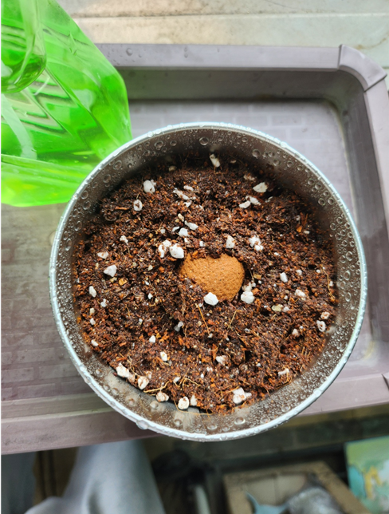
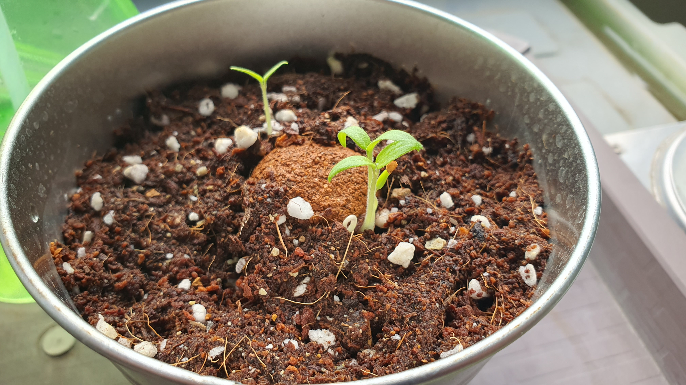
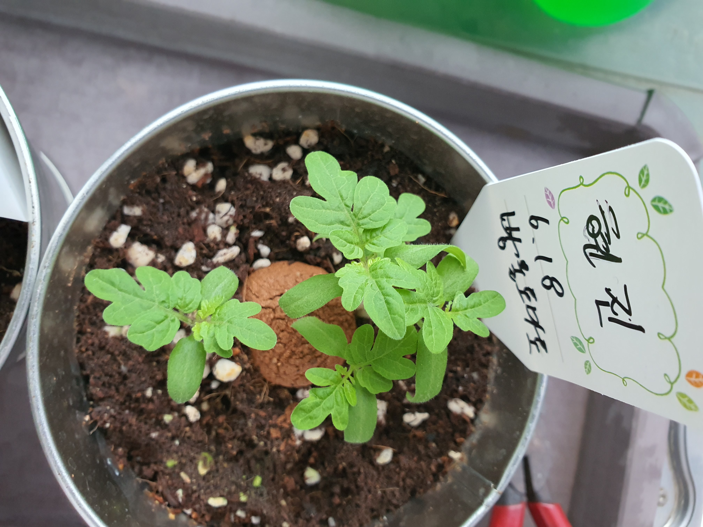

## 일일 관찰 기록

### 📅 관찰일: 2025년 6월 18일 (수요일)

#### 🌤️ 환경 정보
- **시간**: 13 : 53
- **날씨**: 맑음
- **온도**: 28℃ 
- **습도**: % (측정 가능한 경우)
- **일조량**: (많음/보통/적음) 적음

### 📅 관찰일: 2025년 6월 24 (화요일)

#### 🌤️ 환경 정보
- **시간**: 11 : 50.
- **날씨**: 흐림. 
- **일조량**: 비옴.
- **줄기**: 새싹 2개 나와있음.
- **잎 개수**: 6개.
- **색깔**: 연두색.

#### 🌤️ 환경 정보
- **시간**: 8: 01
- **날씨**: 흐림
- **줄기**: 14개
- **잎 개수**: 5개
- **색깔**: 연두색.
- **전체 높이**: 5cm
- **변화한 점**: 6. 24일에 기록했던 것 보다 잎 개수가 늚.

### 📅 관찰일: 7. 10
#### 🌤️ 환경 정보
- **시간**: 16:00
- **날씨**: 맑음
- **줄기**: 16개
- **잎 개수**: 5개
- **색깔**: 연두색
- **변화한 점**: 저번에 기록했던 것 보다 잎개수 늘음.
 

---
#### 🌱 성장 상태
- **전체 높이**: 
- **줄기 굵기**: 
- **잎 개수**: 
- **가장 큰 잎 크기**: cm × cm
- **뿌리 상태**: (관찰 가능한 경우)

#### 🌱 성장 상태
- **전체 높이**: 
- **줄기 굵기**: 
- **잎 개수**: 
- **가장 큰 잎 크기**: cm × cm
- **뿌리 상태**: (관찰 가능한 경우)

#### 🔍 세부 관찰
- **잎의 색깔과 상태**: 
- **줄기 상태**: 
- **특이사항**: 
- **변화한 점**: 