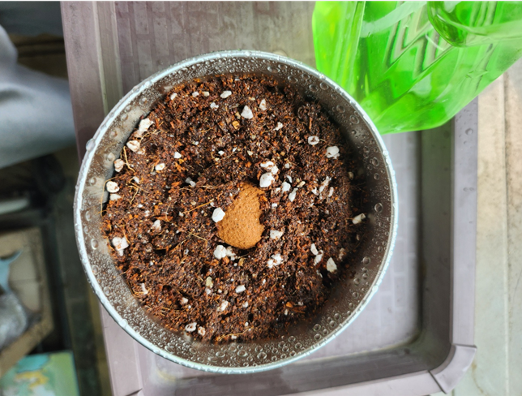

## 일일 관찰 기록

### 📅 관찰일: 2025년 6월 24일 (화요일)

#### 🌤️ 환경 정보
- **시간**: 15: 40
- **날씨**: 흐림
- **온도**: ℃ 27
- **습도**: % (측정 가능한 경우)
- **일조량**: (많음/보통/적음) 보통.

#### 🌱 성장 상태
- **전체 높이**: 1cm
- **줄기 굵기**: 0cm
- **잎 개수**: 1개
- **가장 큰 잎 크기**: cm × cm
- **뿌리 상태**: (관찰 가능한 경우)

#### 🌱 성장 상태
- **전체 높이**: 1cm
- **줄기 굵기**: 0cm
- **잎 개수**: 1개
- **가장 큰 잎 크기**: cm × cm
- **뿌리 상태**: (관찰 가능한 경우)

#### 🔍 세부 관찰
- **잎의 색깔과 상태**: 연두색
- **줄기 상태**: 없음
- **특이사항**: 없음
- **변화한 점**: 잎새귀가 남.