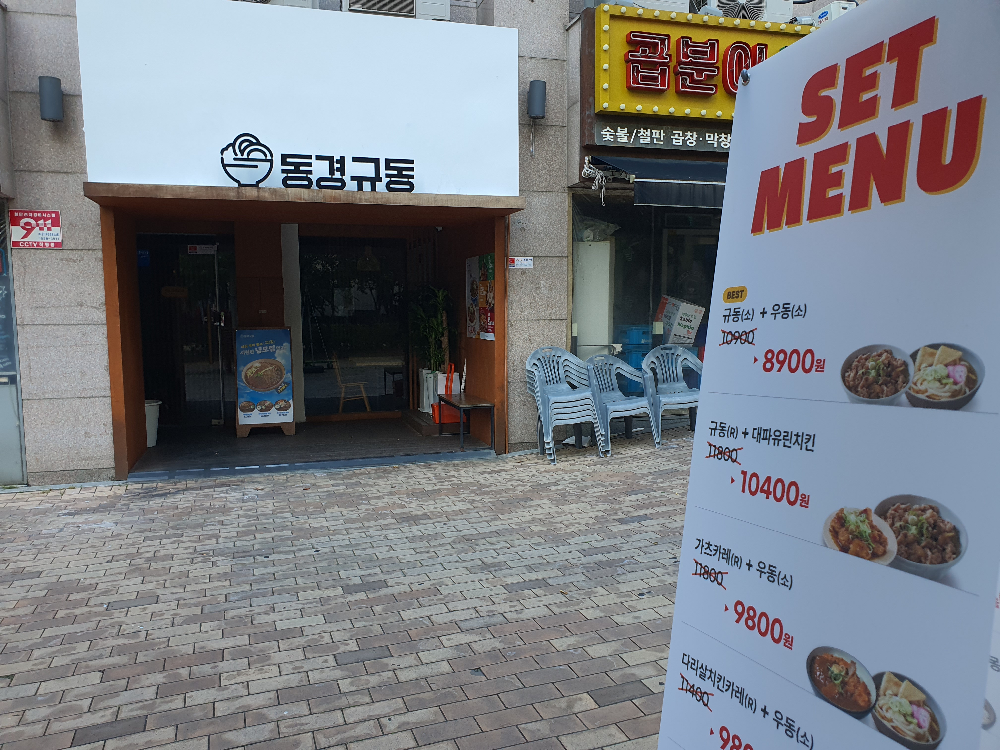
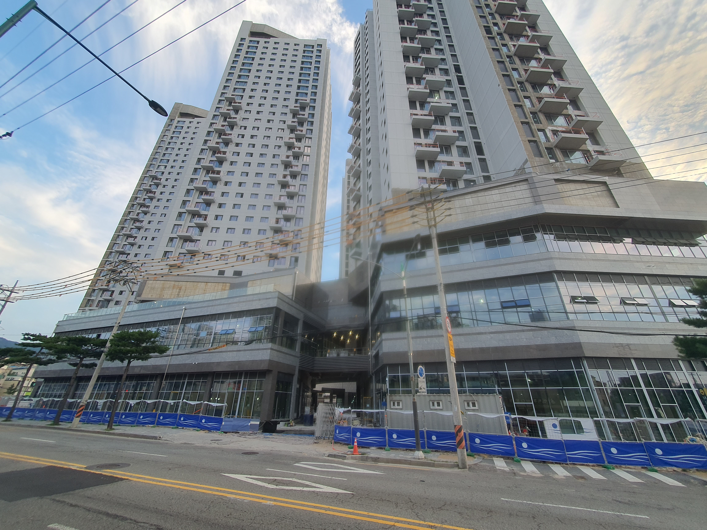

# 우리동네 상가 관찰

## 동산과 부동산
동산은 움직일 수 있는(적음, 예금, ...) 등을 말하며 부동산은 움직일 수 없는(토지, 집, ...)을 말한다.

## 🏬 상가건물

### 프롬프트
```
부동산 분양에서 상가분양 피해 사례를 알고 싶어
```
1. 분양 사기 유형
1. 미분양 및 공실 문제
1. 투자 손실 사례
1. 경제적 요인으로 인한 피해
1. 대응 방안
    * 부동산등기부 등본을 열람해서 소유자 확인
    * 신탁되어 있으면 신탁회사와 분양 계약 체결
    * 계약서에 구두 설명 내용 명시 확인
    * 임대 계약의 주체가 누구인지 정확히 파악

---

### 🏢 롯데 상가
확신에 찾을 때가 가장 위험할 때라는 말을 잊지 않는것이 좋다. 사람은 내가 이게 지금 필요할데 할때 누군가 다가오면 시야가 가려질 수 있으니 주의 해야 한다.

#### 🚫 미분양 및 공실 문제
* 높은 공실율
* 수익률 하락
* 수익률 보장 사기

---

### 🏙️ 7단지 상가

* 동경우동 폐업의 수순인가?
이곳은 처음 생겼을때 작년에 한번 가본곳인데 고기의 두께가 무척 두껍고 맛이 괜찮았는데 안쪽에 빨간게 보인다고 더 익혀 달라는 손님도 있었다.

* 아래 할인은 폐업을 하기전 도전해 보는 것인가?
    - 다른곳에 비해 가격이 고가인것은 분명하다 그래서 초기와 다르게 손님이 줄어 들었을까?

    


---


### 🏠 8단지 상가

#### 고기집(축산) 경쟁의 결과는?
현재 한곳이 이미 자리를 잡고 있고(오빠축산) 그리고 아래쪽 롯데리아 쪽에도 고기집이 있는데 그 사이 비집고 고기집이 오픈을 준비하고 있다.

* 현재 고기 판매 현황
    - GS마트
    - 롯데리아 아래 축산
    - 계성고등학교 오빠축산

    
    


---

### 🏠 삼양동 사거리 신축건물

#### 신축후 활성화?
* 현재 신축 건물의 배후에는 단독주택만 있어 활성화 되기 쉽지 않아 보인다.
    - 현재 활성화 되어 있는곳은 뒤쪽에 아파트의 배후단지가 있는 상태로 위치가 더 좋다.
    - 물론 현재 주상복합 형태로 아파트의 주민들이 이용이 가능하겠으나 한계는 분명하게 있다.
    - 횡단보도를 건너와도 메리트가 있을만한 뭔가 들어와야 하는데 그리 쉽지 아니할듯 싶다.
    - 프랜차이즈가 뭔가 오거나 해야 하는데 아니면 길음동 처럼 기존의 상가가 새로운 건물쪽으로 이사를 가거나 해야 하는데 간단해 보이질 않는다.
    - 예를 들면 현재 있는 스타벅스만 해도 현재 위치가 배후에 아파트가 더 많고 바로 옆이 시장(물론 많이 이용은 안하겠지만)이 있어 이사할 필요는 없어 보인다.

    
    

* 길음역 롯데처럼 70% 이상 공실 가능성
    - 안쪽에 동이 하나 더 있고 상가가 지하에 있는지는 모르겠지만 위쪽에 3층으로 되어 있고 엄청난 규모 이다.
    - 새로운 시장을 창출하는 그런것이 분명 아닐텐데 ... 그렇다면 위쪽 벽산, SK 쪽에서 차를 가지고 와야 하는 .... 문제는 거기도 상가가 있다.

    
    
    
    
    
    
    