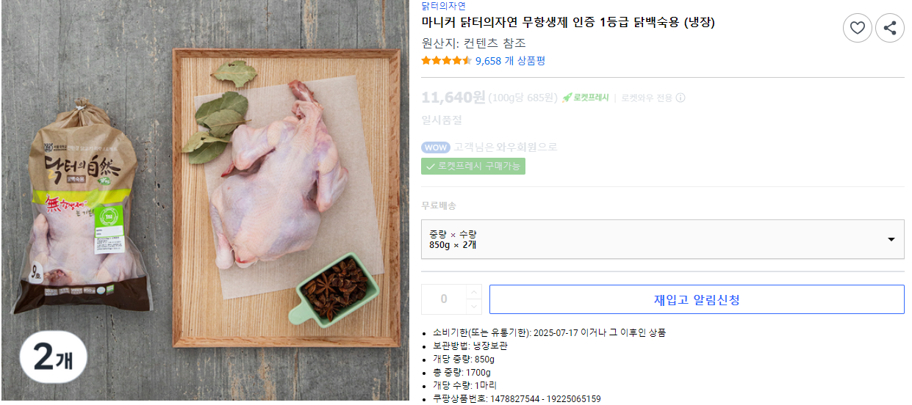
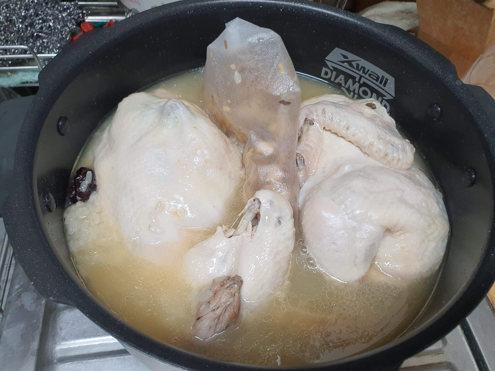

# 잘 먹자

* 목적
같은 실수를 반복하지 않고 시행착오의 결과를 다시 격지 않기 위해서 기록 하는 것이다. 즉 시행착오를 발전 시키기 위한것

## 삼계탕 or 백숙
적은 재료로 쉽게 만들어 먹을 수 있는 먹거리

### 마니커 850g 2개
10인용 압력 밥솥에 꽉차게 들어가기 때문에 닭을 옆으로 그리고 삼계재료를 그 안에 삐집어 간신히 넣은 상태이다.

* 결과는
  - 80분 쿠쿠 만능찜으로 조리를 하였다.
  - 뒤쪽에 물 받침이 넘처 흘렀다.
  - 앞으로 백숙 안에 찹쌀을 넣을 필요는 없어 보인다. 밖에 그냥 두구 삼계죽으로 먹고 마무리 지으면 된다. (이러면 시간을 줄여도 될듯)
  - 물을 많이 넣을 수 없다. 현재도 눈금선 가까이 최대한 맞춘 형태

* 앞으로
  - 맛은 그냥 그래서 앞으로 1.1Kg 같은것 구매해서 백숙을 해 먹는 방법을 생각해 보면 좋겠다.
  - 국물을 많이 나오게 할 수 있다.
  - 여유가 되면 인삼 같은 것 추가

## 양념불고기

