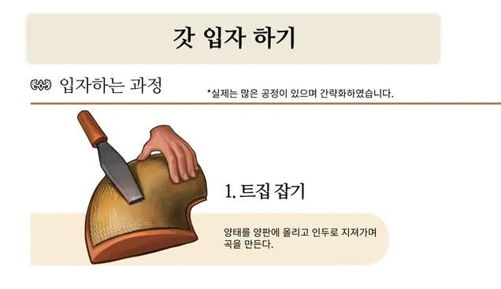
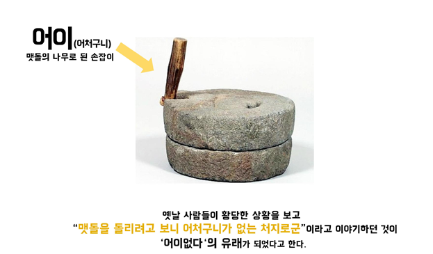

# 사자성어 / 어원

## 트집
트집의 본래 뜻은 조선시대 갓을 만들때 평평한 부분을 만드는것을 트집이라고 하는데
갓을 오래 사용하다보면 수선을 해야 하고 이때 수선비를 많이 받기 위해서 트집에 문제가 있다고 하여 수선비를 더 받으려 하는데 있어서 생긴 말이라고 한다.
* 참고자료: https://www.google.com/search?q=갓의+트집&tbm=isch
* 트집잡기

  

## 어이없다
맷돌의 손잡이를 '어이'라고 한다.

  

* 참고자료: https://www.google.com/search?q=멧돌+어이&tbm=isch

## 조삼모사
원숭이에게 아침에 먹으면 3개 - 저녁에 먹으면 4개 먹을 수 있다고 했는데 당장 먹고 싶으니 아침에 먹겠다고 했다.

### 실험
  - 사람은 당장 급하게 뭔가 해야 하는 그런것이 아니면 모두 참을 수 있다. 하지만 참지 않아도 되기 때문에 참지 않는다.
  - 아이스티 오늘 안먹으면 다음주 2개 다다음주 4개 까지 안먹으면 그다음주는 6개

### 스탠포드 마시멜로 실험
  - 월터 미셸이 1972년에 실시한 유명한 지연 만족 실험

#### 실험의 주요 문제점
  * 사회경제적 배경의 영향
    - 가장 큰 문제는 실험 참가자들이 대부분 스탠포드 대학교 부속 유치원의 중산층 이상 가정 아이들이었다는 점입니다.
    - 경제적으로 안정된 환경의 아이들은 "기다리면 좋은 것이 온다"는 경험을 많이 했기 때문에 참을성을 보이기 쉬웠어요.

  * 표본의 대표성 부족
    - 참가자가 소수(90여 명)였고, 다양한 사회계층을 대표하지 못했습니다.
    - 나중에 더 큰 규모로 다양한 배경의 아이들을 대상으로 한 연구에서는 원래 결과가 크게 약화되었어요.

  * 환경적 신뢰도 문제
    - 아이들이 어른을 얼마나 신뢰하는지가 큰 변수였습니다.
    - 불안정한 환경에서 자란 아이는 "나중에 더 준다"는 약속을 믿지 않아서 즉시 먹는 것이 합리적 선택.

  * 인과관계 vs 상관관계 혼동
    - 참을성이 성공을 가져온다기보다는 안정적인 가정환경이 참을성과 성공 모두에 영향을 미쳤을 가능성이 높다.
    - 결국 이 실험은 개인의 의지력보다는 사회경제적 환경이 얼마나 중요한지를 보여주는 사례가 되었습니다.

### 결론
조삼모사가 보편적 인간 심리의 한계를 보여준다면 마시멜로 실험은 그 한계마저도 사회적 환경에 따라 달라진다는 것을 증명했다.
결국 개인의 선택이라고 여겨지는 것들도 사회구조 안에서 이해해야 한다는 교훈을 준다.

---

## 하면된다
참 좋은말이다 하지만 어떻게 하면 되는지 구체적인 세부 행동방식이 있으면 더 좋다.
* 벽에 큰 클씨로 "하면된다" 아무리 크게 붙여놔도 큰 효과를 보기 힘들다. 예를 들면 다음과 같이 구체적으로 지침을 만드는 것이 좋다.
  - 이것보다는 아침 7시에 일어나서 산보하고 OOO책을 30분간 읽고 정리한다.
  - 하루 단어 00개씩 외우고 본다.
  - 아침 9시부터는 1일전 3일전 7일전 정리한 노트를 보고 복습을 10시까지 한다.