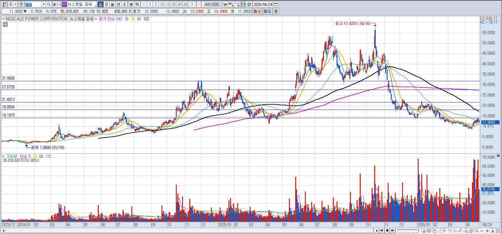

# 미국 원전 관련주

* XE, SMR, 오클로
    - 모두 수익없이 손실만 발생중. 국내 두산에너빌리티는 미국 SMR 기업의 실제 수익구조과 무관하게 기술협력으로 수익이 발생

* 솔실 부분은?
    - 이번 반등을 성급하게 판단한것으로 보임.
    - 2030년을 바라봐야 하는 시점에서 당장 필요한 돈은 아니지만 VIX 10 이하일때의 기회비용이 발생

* 진입시점은?
    - VIX 10 아래일때 매수
    - 지금 보다 비싸게 매수 하게 되어도 전고점 돌파가 발생 하면 그때 하는것이 바람직해 보인다. 
    

* 평균주가를 보는곳
    - 절대 중간 이상에서는 사면 안된다. 그리고 내부자가 어떻게 하고 있는지 보고 사야 한다. 
    - https://seekingalpha.com/symbol/SMR/ratings/sell-side-ratings

* 내부자 매도가 얼마나 되는지 보는것
    - 가능하면 내부자가 스톡옵션 행사해서 판매한 금액보다 작게 매수 하는 것이 좋다.
    - https://finviz.com/quote.ashx?t=SMR&ty=c&ta=1&p=d

    - 내부자가 산 티커만 볼 수 있는곳: http://openinsider.com/latest-cluster-buys

