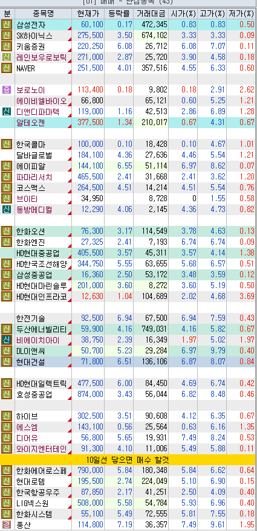
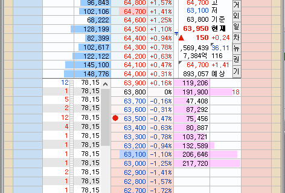
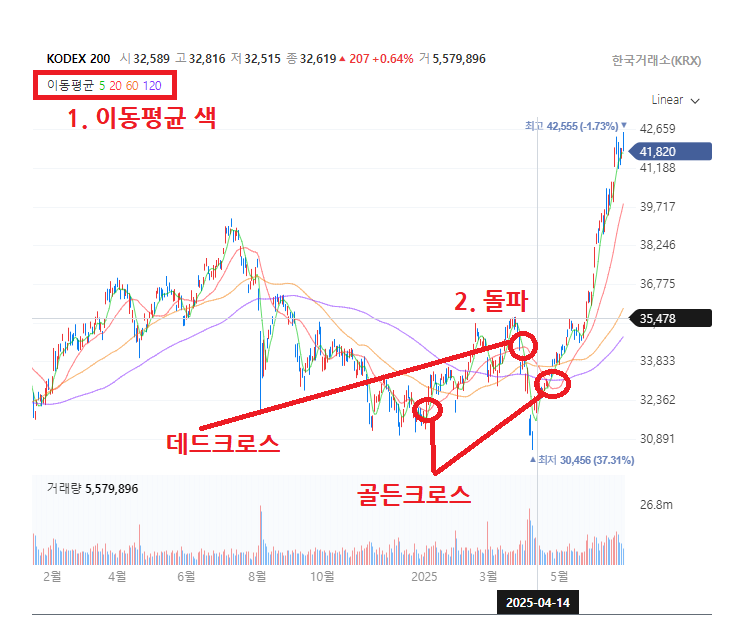
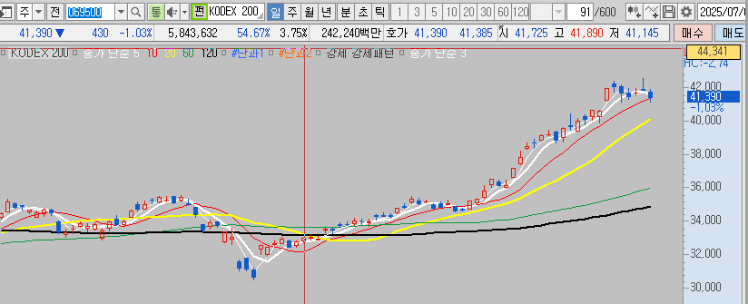
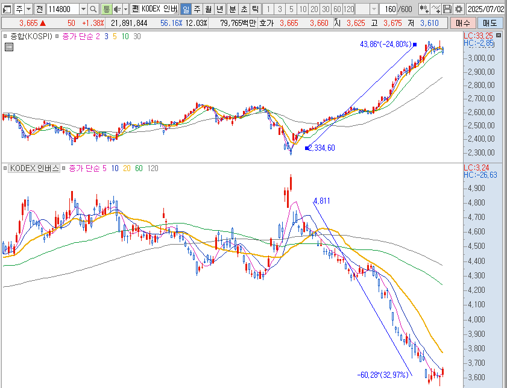

# 주식시장
심리를 잘 다스릴 수 있어야 하며 그렇기 위해서는 계좌관리와 무리 하지 않는것이 무척 중요하다

* 계좌관리
  - 사람마다 그릇의 크기는 다르지만 처음부터 큰 돈을 벌 생각으로 신용을 쓰는 행위는 좋은 결과를 가져오기 쉽지 않다.

* 때
  - 일년에 한번 또는 두번 큰 폭락이 발생을 하는데 이때를 기다릴 줄 알아야 한다.
  - 좋은 때를 만나게 되면 어렵지 않게 수익을 얻을 수 있다.
  - 기다리고 기다리고 올해가 아니면 내년 내후년에는 기회가 올것임은 확실하기 때문에 참는게 이기는 것이다.
    + 포모가 왔을때가 가장 위험 한데 참지 못하고 매매 하면 이때가 고점인 경우가 많다.(참다 참다 매수 하는 시점이기 때문에)
  - 추격매수 같이 심리가 무녀져 매매하는 뇌동매매는 행운으로 성공을 했다 해도 반성해야 될 일이다.
  - 아무것도 하지 않는것도 하는것이다. 하지 않겠다고 하는것 자체도 선택이기 때문이다.
  - 살아 남아 있으면 기회는 언제 든지 있다. 그렇기 때문에 기본 자본금(씨드) 소중하게 간진하고 있어야 한다.
    + 실제 하락이 진행되어 바닥인것을 인지하고 투자 하려면 보통의 사람들은 돈이 없다. - 그래서 회복을 하지 못하는 문제가 발생 한다.

* 손해 보지 않아야 한다.
  - 투자를 해서 이익을 보는 방향 보다는 손해를 보지 않는쪽으로 해야 수익을 얻을 수 있다.
  - 투자대회에서 아무것도 하지 않으면 수익율 0% 인데 상위 20% 안에는 무조건 들어가는 순위이다.
  - 실전 투자에서 수익을 내는 사람은 그리 많지 않다.

* 손실을 보는 사람
  - 장이 열려 거래가 가능한 시간에 열심히 매매 하는 사람은 수익을 보기 힘들다
  - 장이 열리기 전에 종목 및 산업에 대한 공부를 하고 시나리오(계획)를 준비해 장이 열렸을 때 이대로 매매하고 계획과 다르면 하지 않는것이다.
    + 하지 않는것도 선택이며 기회는 또 오기 때문에 반드시 뭔가를 하려 해서는 안된다.

* 손절
  - 지수 상승장일때 손절 하지 않아도 80% 확율로 다시 살려주는 경우가 많다. - 이 때문에 손절을 우습게 보다 한방에 가게 된다.
  - 하락장이 시작되면 손절 하지 않은것은 눈떵이 처럼 커저 전체 계좌를 망치게 된다. 그렇기 때문에 평소 손절을 잘 해야 한다.

## 매우 중요!!
🚨 **중요**: 수익은 시장이 주는 것이다.
* 지수안에 > 섹터(테마) 있고 > 섹터안에 종목있다.
  - 단타는 스윙이 가능한것만 하는것이며 스윙투자는 지수가 횡보하거나 올라갈때 하는 것이다.
  - 가장 안전한 방법은 1년에 1 ~ 2회 폭락이 있을때 시나리오에 따라 매매 하는 방법으로 참고 또 참으면 기회가 반드시 온다.

* ☢ 수학처럼 1 + 1 = 2 라고 고정된 생각을 가져선 안되며 상황이 바뀌면 생각도 바뀔 수 있어야 한다.
  - 아래에 예가 있는 경우 그럴 가능성이 높다는 것이지 반드시 그렇다는 것이 아니다.
  - 투자에선 모든 사람들이 100%란 없기 때문에 항상 플랜 B, C, ... 등을 준비하고 있어야 한다.
  - 확실하다고 생각하여 크게 투자 할때가 가장 위험할 때 일 수 있다.

## 종목투자
가능하면 하지 않는것을 권장한다. 하게 되면 종가매매를통해 시가에 매도하거나 스윙을 하되 손절을 계획하에 하는것만 가능하다

* 국장, 미장 모두 컨센서스가 있는 종목만 투자 하는것이 좋다.

* 미장: 국장에서 투자 할 수 없는 종목을 투자 하거나 지속 성장이 되고 있기 때문에 지수 투자도 좋은 편이다.
  - 구글, 엔비디아, 마이크로소프트, ... 국내시장에서는 투자 할 수 없고 세계 1위 회사에 투자 하고 싶을때
  - 하지만, 양자컴큐터 SMR 일부 방산주등 국장에서 투자해도 문제 되지 않을 종목은 굳이 미장까지 가서 투자할 필요는 없다.

* 안정적인 방법
  - 논문에선 종목의 수를 20~30개정도 가져가는 방식이 안정적이라 한다.(인덱스 펀드의 개념이 들어감)
  - 5개 이하로 가져가는 경우 한번 깨지기 시작하면 손실폭이 엄청날 수 있다.

* 돌파
  - 고점에서 사는 방법을 말하며 이전 고점을 넘어서는 것을 말한다. 보통은 돌파가 성공하게 되면 상승세가 지속 된다.

* 눌림
  - 저점에서 사는 방법을 말하는데 실제 저점은 어디 인지 알 수 없기 때문에 더 내겨갈 가능성도 많아 여러번에 나눠서 살 계획을 가지고 있어야 한다.

* 지수가 -2% 하락이면 종목은 최소 2 ~ 4배까지 하락하는게 수두록 하다는것을 잊지 말아야 한다.
  - 아래는 kodex 200 -1.8% 하락 했을때의 주도주(2025.07.02) 관심 종목의 상황이다.

    

### 호가창 보는법
이것을 혼자 스스토 터득하기 가장 좋은것은 영상 녹화를 하고 매일매일 복기 하는것인데 쉽지 않을것이다.
* 목적
  - 최소한 이정도는 알고 있는것이 모르는것 보다 낫기 때문에 설명이 있는것이며 개별 종목 투자는 가능한 하지 않는것을 권장 한다.

* 아래는 기본적인 호가창 보는법
  - 본래 라운드피겨 가격에 숫자가 많은것은 이해가 된다. 보통 그렇게들 사거나 팔기 때문에
  - 라운드피겨 가격이란 딱 떨어지는가격 7만원 6만5천원 6만3천원 이렇게 이런 라운드피겨 가격도 7만원 처럼 한 단위가 바뀌는것이 영향이 크가

    

  - 위 이미지에서 63,700 63,900 이렇게 숫자가 많은것을 볼 수 있는데 이 가격으로 사겠다는 거다
    + 라운드피겨 가격이 아닌데 이렇게 매수를 하겠다는 것은 사고 싶으면 이 물량 다 소화될때 까지 못사니 한호가 위로 사라는 의미가 된다.
    + 이렇게 받치는것이 왔다 갔다 할 수 있는데 이것을 잘 봐야 한다.
  - 받처 있던것이 아래(1호가)로 내려가면?
    + 내가 누구한테 배운것은 아니지만 내것을 팔때 내가 받쳐 놓고 내것을 내가 사는 경우가 되기 때문에 한단계 내리면 다른 사람것에 팔 수 있다.

## 지수투자
* 인덱스 펀드
  - 인덱스 펀드를 이기는 액티브 펀드는 흔지 않으며 **펀드 순위를 보면 인덱스 펀드가 상위 10개중 8개 이상 차지**하는것을 보는 것은 어렵지 않다.
  - 개인이 직접 종목을 사는 행위는 액티브 펀드에 해당 한다. 실전에서 해보면 안다 내가 지수를 이기고 있는지 아닌지.
  -

* 종목 투자는 결과를 보고 이때 샀어야지 하지만 그렇게 쉬운것은 아니다.
  - 물론 미장의 경우 세계 1위이며 다른 어떤 나라에서도 할 수 없는 일을 하고 있어 계속 성장하는 경우는 좀 다르긴 하다
  - 지수 투자는 미장, 국장 모두 유효하며 5일 이동 평균성이 20일선 뚤고 올라가느냐 내려가느냐에 따라 결정을 하면 된다.
  - 아래 이미지를 보면 알 수 있지만 딱 맞지 않은 경우도 있기 때문에 추세를 볼 줄 아는 능력을 키워야 한다.
  - CNN의 공포와 탐욕지수와 같이 보고 판단하면 확율을 높일 수 있다.

* 매수
  - 5이평이 20이평을 뚥고 올라갈때 산다.
  - 이렇게 하는 이유는 어디까지 떨어질지 모르기 때문인데 실제 해보면 계좌를 몇개로 나누어 일정 부분 떨어질 때 마다 매수하는 것이 좋다.
  - 즉, 20% 떨어졌을때 한번에 모두 매수 하는 방법은 그 때가 바닥이면 좋지만 오지 않을 수도 있고 더 내려 갈 수도 있다.
  - CNN 공포와탐욕지수 20 이하일때 분할하여 매수 하기 시작

* 매도
  - 5이평이 20이평을 뚥고 내려갈때 판다.
  - 2025년을 보라~ 어디 까지 올라갈지 모른다. 그렇기 때문에 데드크로스가 발생 했을때 매도 하는 방법이 좋다.
  - 너의 아버지는 이걸 알고 있으면서도 매도 할때 이걸 생각 못해서 너무 일찍 팔았다.

  

* 코스피 PBR
  - http://data.krx.co.kr/contents/MDC/MDI/mdiLoader/index.cmd?menuId=MDC0201010107

* M2 관련 다른것과 같이 볼 수 있는것
  - https://charts.bgeometrics.com/m2_global.html
  - 매크로 보는데 유용해 보인다:

* 인버스
  - 주가가 하락하면 이익을 보는것
  - 매우 위험한 투자이며 왜나하면 올라가는 폭은 정해진 기준이 없이 때문에 이론적으로 손실이 무한이다.
  - 지수 인버스는 좀 다르며 시나리오를 세우고 투자하면 이익을 볼 수 있다.

## 미국증시

* 전세계의 돈이 미국으로 몰리고 전세계 1등 기업이 많아 계속 오르고 있지만 정말 무서울 수 있는 곳이다.
  - 여긴 하루 50% 오를 수도 있지만 반대로 하루 -50% 되어 아침에 일어나 보면 계좌가 반토막이 되어 있을 수 있다.
  - 실제로 올해 2월 전황스승은 아침에 일어나 보니 주식이 하나도 없더라는 것이다. 그래서 원인을 확인해 보니 (자동손절 기능 작동)

* 레버리지 상품은 어느곳에서나 위험한 투자이다.
  - 3배는 30% 하락하면 청산 되어 없어질 수 있으니 절대 하면 안된다. 2배도 그러하며 CNN 공포와 탐욕지수가 2까지 떨어진다면 전체에서 10% 정도 고려
  - 차라리 대출을 받거나 신용등을 활용하는 것이 위험이 덜하다. 빛을 내어 투자하는 방법도 여러가지가 있으며 기간위험 등 감안을 하고 투자 해야 한다.

## 실전투자

### 전략
  * 마틴게일 전략(Martingale Strategy) 또는 **평균단가 하향 매수법(Dollar Cost Averaging Down)**
    - 도박에서 나온 개념으로, 손실이 날 때마다 베팅 금액을 두 배씩 늘려서 한 번 이기면 모든 손실을 회복하고 이익을 얻는 방식입니다.
    - 카지노에서는 이 방법을 금지하거나 베팅 한도를 두어 제한하고 있습니다.

    주식 투자에서는 이를 변형하여 주가가 하락할 때마다 매수 물량을 늘려 평균 단가를 낮추는 방식으로 사용합니다. 하지만 이 방법은 다음과 같은 위험이 있습니다:

    - 주가가 계속 하락하면 손실이 기하급수적으로 증가
    - 자금이 고갈될 수 있음
    - 해당 종목이 회복되지 않으면 큰 손실 발생

### 취소한것
  * 삼성전자
    - 계획이 있던것은 취소 되었다. 돌파 했을때 CD 매도가 안되어 시간외에서 사지 못했고 다음날 굳이 살 필요는 없었다. 10시 이후 하락 했기 때문에 ..
    - 그리고 그 다음날 돌파한 부분 아래 까지 하락 되었는데. JP모건쪽에서 많이 들어온 경우는 알고리즘 매매가 많다고 한다.
    - 보통 이런식으로 프로그램이 하루종일 하고 그 다음날 아침에 하루종일 파는 경우가 종종 발생해서 조심해야 한다.

### 2025.07.02(수) 코스피 인버스
  다음과 같은 시나리오를 통해 매매를 할것이며 현재 코스피 지수 PBR에서 손해를 보지 않을 계획은 아래와 같다.

  * 참고
    - 항상 내가 매수 했을때 위로 아래로 30%의 등락은 있을 수 있다고 가정하고 시나리오를 짜야 한다.
    - 정부 정책에 맞서지 말라는 말이 있다
      + 부동산 보다는 주식 시장에 더 관심을 가지겠다는 이재명 정부의 정책을 무시 해서는 안된다.
      + 미장 오른것을 대략 계산하면 코스피 지수 5천이 나온다. 그렇다면 여기 까지 올라갈 수 있다는 가정하에 분할 매수 계획이 있어야 한다.

  * 매수 이유
    - 국장은 코스피 키준 PBR 0.8 ~ 1.? 사이의 박스권 장세이다.
    - 현재 상반기 많이 오른 상태 이며 여름을 지나 가을에 한번 하락할 가능성이 있다. 미장 나스닥 신고가 나온 상태
    - 분할 매수 계획이며 내년까지 가지고 있겠다는 마음으로 한번은 코스피 PBR 0.8 부근까지 갈것이라 생각이 든다.
    - 보통 홀수해는 시장이 좋으며 짝수해는 좋지 않은 경향을 보인다 - 물론 계절성이 무조건 맞는것은 아니며 시황을 잘 봐야 한다.
    - 2025.07.01 코스피 PBR: 1.04
      + http://data.krx.co.kr/contents/MDC/MDI/mdiLoader/index.cmd?menuId=MDC0201010107
    - kodex  200 흑삼병이 지난주 나타났다.

      

  * 초기 투자금: 100만원 - 마틴게일 전략
    아래와 같은 방법으로 총 3회 추가 매수 계획을 가진다. **아래 추가 매수는 시황에 따라 15% 하락이 아니라 20~30%가 될 수 있다**
    - 손실 -15% 이면 100만원 추가 매수
    - 위 매수 후 손실 -15% 이면 200만원 추가 매수
    - 위 매수 후 손실 -15% 이면 400만원 추가 매수

      

  * 손절 2025.07.04(금) - 정부에 맞서지 말라!
    - 하락을 위한 조정이 아니라 상승을 위한 조정으로 보여 손절하고 데드크로스 발생할때 다시 진입할 예정
    - 시나리오 대로 흐르지 않는다면 과감한 손절이 필요하고 미리 손절 계획을 가지고 매수 해야 한다.

