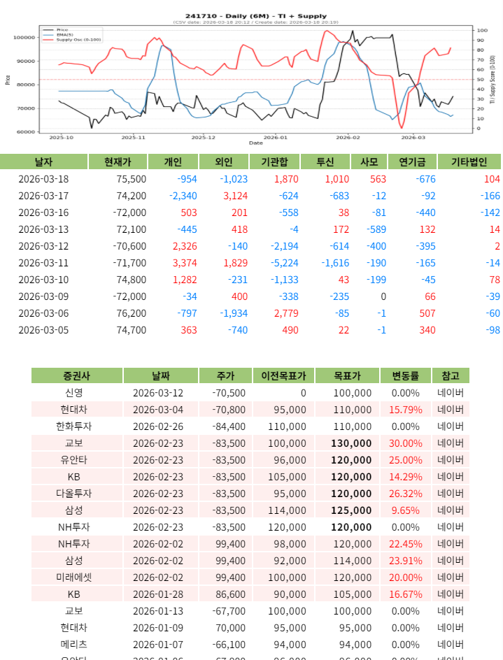

# 매매일지
왜? 매수 했고 어떤 목표를 달성해서 또는 손실이 발생해 매도 했는지 시나리오대로 했는지 아니면 예상치 못만 문제가 발생하여 응기응변으로 처리 했는지등에 대해 자세한 일지를 써야 다음에 같은 방식의 실수를 하지 않게 된다.

## 중요사항
- 주식은 이익보다 손실을 보지 않으려 노력해야 비로서 이익이 발생 하게 된다.

---

## 종가베팅

### 참고해야 할것

### 대상종목 선정

---

## 매수/매도 관점

### 폭락했을 때
  - RSI 시그널을 보고 KODEX 200 지수 종목을 매수 한다.
  - 1년에 1회 ~ 2회 정도 발생하며 8% 10% 15% 등 하락의 폭에 따라 매수하는 단계의 시나리오를 가지고 있어야 한다.
  - 3년, 5년, 10년에 한번씩 오는 사이클이 1년 사이클과 겹칠 수 있는 점을 항상 염두해 둬야 한다.

### 2026.03.18 현대차 18주 - NXT
  * 보스턴다이나믹스 - 일정
    - https://www.youtube.com/watch?v=IGJkarm0SrA

  * 이번에는 좀 더 오래 가지고 있어 보기
    - 반도체에 비해 이란전쟁으로 인한 유가폭등 후 하락한 부분 반등이 적은 상태로 일정이 있어 상승 가능성 높음

---

## 관찰
* 코스메카코리아, 한국전력
  - 한국전력과 비슷한 크기로 폭락을 한 상태. 현재 미용/화장품은 주요 테마에 들어가지 않는다.
  - 비슷한 상황이라면 한국전력이 더 낳을 수 있다. AI 전력으로 올랐기 때문에.

  