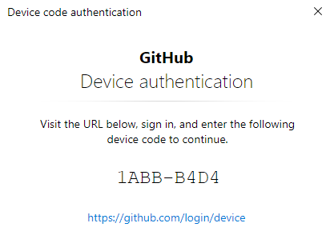
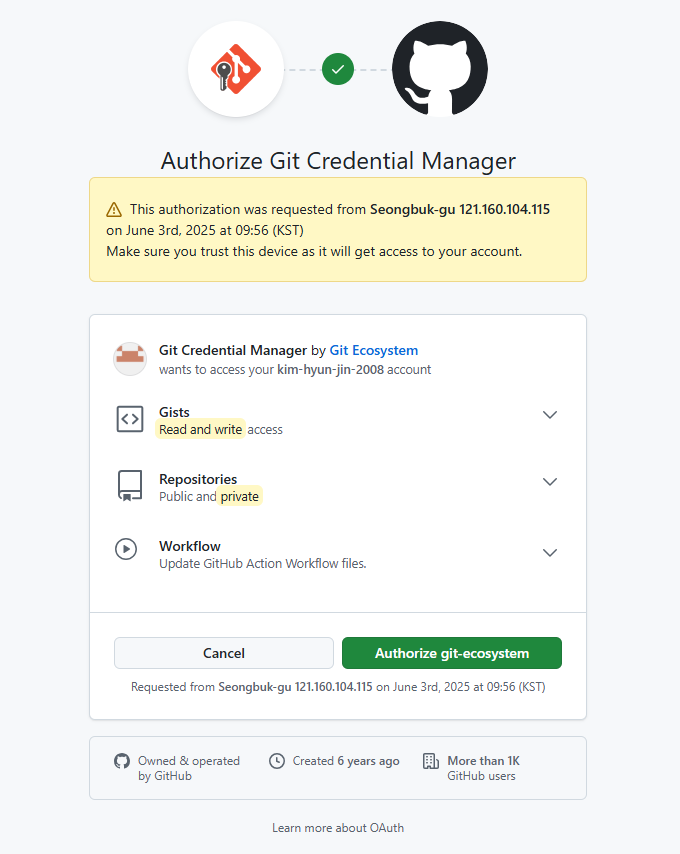
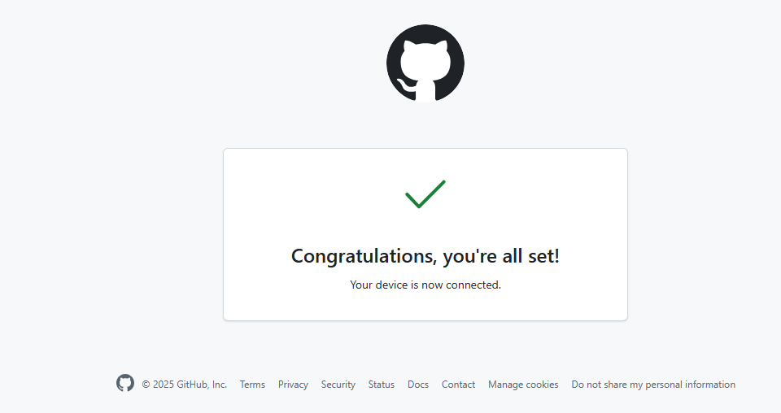

# 초기 설정

## 회원가입하고 처음나온 화면 
```
https://github.com/kim-hyun-jin-2008/high-school.git
```

### …or create a new repository on the command line
```
echo "# high-school" >> README.md
git init
git add README.md
git commit -m "first commit"
git branch -M main
git remote add origin https://github.com/kim-hyun-jin-2008/high-school.git
git push -u origin main
```

### …or push an existing repository from the command line
```
git remote add origin https://github.com/kim-hyun-jin-2008/high-school.git
git branch -M main
git push -u origin main
```

### 아래는 ssh 선택 했을때 나온것 
```
git@github.com:kim-hyun-jin-2008/high-school.git

echo "# high-school" >> README.md
git init
git add README.md
git commit -m "first commit"
git branch -M main
git remote add origin git@github.com:kim-hyun-jin-2008/high-school.git
git push -u origin main

git remote add origin git@github.com:kim-hyun-jin-2008/high-school.git
git branch -M main
git push -u origin main
```

---

## 깃 배쉬 다운로드
https://git-scm.com/downloads/win

파일을 다운로드 받은은 별도의 설정 선택 같은것 없이 '다음'을 클릭해서 설치를 해주었다.

### 설정
https://jellili.tistory.com/24
```

git config --global user.name "김현진"
git config --global user.email "kimhhhhjin@gmail.com"

# 설정확인
git config user.name
git config user.email
git config --global --list

# 로컬 저장소 생성
git init

# 리모트 등록
git remote add origin https://github.com/kim-hyun-jin-2008/high-school.git
git remote -v

git add .
git commit -m 'commit 메모쓰기'
git push origin master

# 간략하게 한번에 명령 보내기
git add .; git commit -m '변경 내용 메모'; git push origin master
```

#### 초기 인증
위에서 푸시하면 먼저 아래 화면을 보게 된다. 

##### 1. 첫번째 보게 되는 화면
아래 중요한 인증용 단어가 있으니 창을 닫으면 안된다. 



##### 2. 로그인 되어 있는 웹브라우저에서 아래 주소로 들어간다. <br>
https://github.com/login?return_to=https%3A%2F%2Fgithub.com%2Flogin%2Fdevice


##### 3. 위주소로 들어가게 되면 보이는 화면


##### 4. 1에서 나온 인증용 문자입력
화면 캡처 된것은 없지만 인증 문자를 넣어 주면 정상 등록 처리 된다. 
그리고 다시 git push를 하면 된다.

##### 5. 정상 처리 되면 보게 되면 화면
