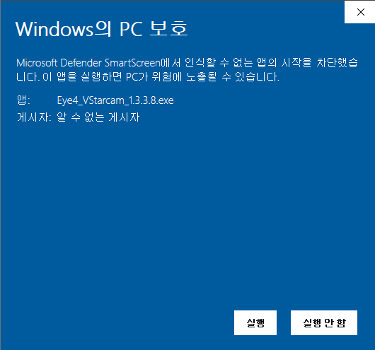
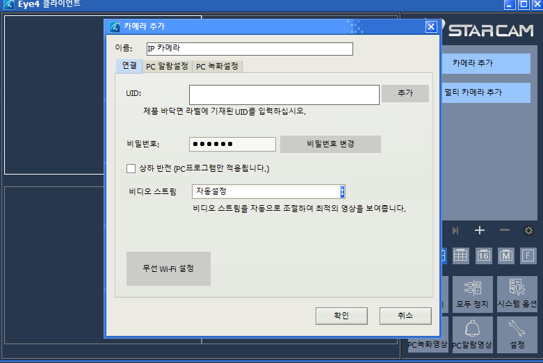

# 브이스타캠

## 프로그램 다운로드
https://www.vstarcam.co.kr/atboard.php?grp1=support&grp2=download

https://www.vstarcam.co.kr/atboard_view.php?model=&grp1=support&grp2=download&uid=12138&keyfield=&keyword=&page=1

어떤 이유에서인지 압축된것을 또 한번 압축해서 배포를 하고 있는데 이유는 아래 현상 때문에 한번더 압축을 해서 체크하지 못하게 한것으로 보인다. 사용에는 문제 없으니 참고만 하고 설치를 진행해 주면 된다. 

추가 정보 클릭하면 아래 화면이 나오면 설치 클릭해서 설치 하면 된다.

## 설정방법

로그인은 모바일 어플에 보면 메일주소가 뭐로 되어 있는지 알 수 있고. 비밀번호는 알 수 있는 방법이 없기에 알아 내야 한다. 

* 새로운 계정
    - 만약 계정을 새로 만들게 되어 추가하는 방법이 있는데 이 경우는 카메라의 비밀번호를 알아야 하는데 적어 놓은것이 있거나 알고 있어야 한다. 
    - 모른다면 어플에서 비밀번호를 변경하는 방법이 있는데 이 경우는 기존에 연결해서 사용하고 있는 모든 클라이언트에서 변경을 같이 해줘야 하는지는 별도 확인이 필요한데 해보지 않은것이지만 계정 따라 가는것이기 때문에 하지 않아도 될듯.

