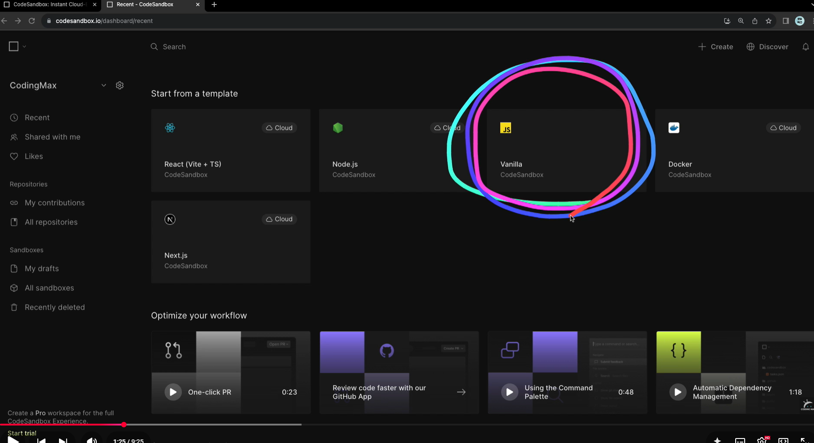
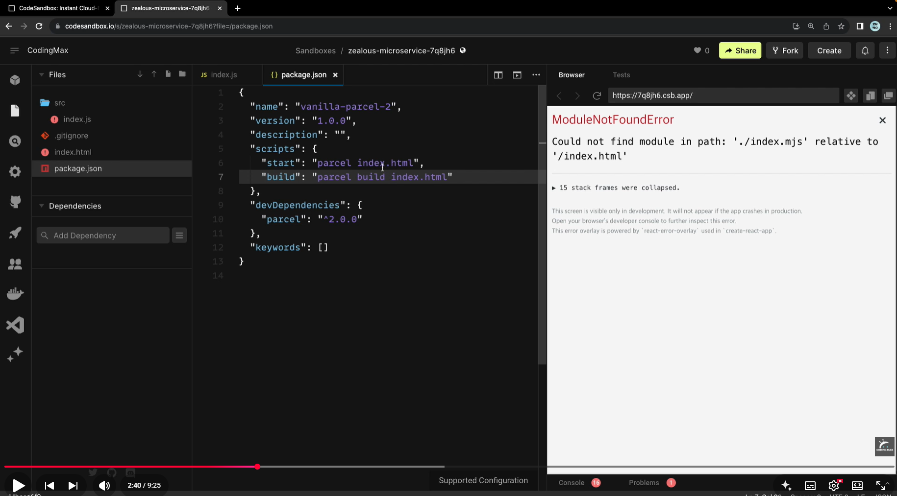
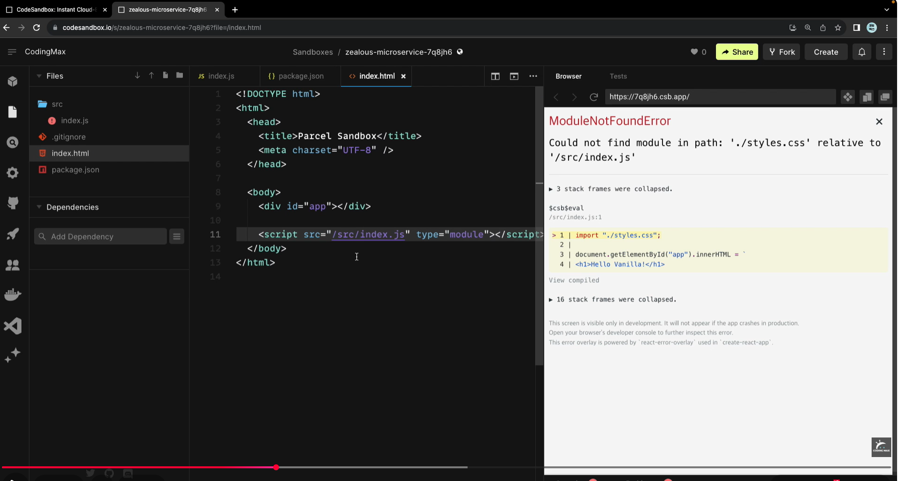

# 1. 실습환경
결과를 쉽게 확인 할 수 있는 코드샌드박스 활용

해보면 좋은데 설정이 복잡해서 이것 사용하지 않습니다. 기존방식대로 cmd 에서 node 실행하면 문제 없음.

##
https://www.youtube.com/watch?v=VYVyKIs-ai0&list=PLFzP8RKjiyFEVJAtARaUsRMPM0u-rd0kF&index=1

1) 회원가입하고 스크롤 내려서. 바닐라 자바스크립트 선택

2) 설정
* 필요없는 css 삭제.
* index.html 아래로 이동(.gitignove)
* package.json 파일을 아래와 같이 수정

3) index.html에서 실행하는 js 파일 경로 변경
/src/index.js

---
캡처에 한계가 있고 시간 문제가 있으니 영상을 보고 설정을 계속 진행 합니다.

##

##