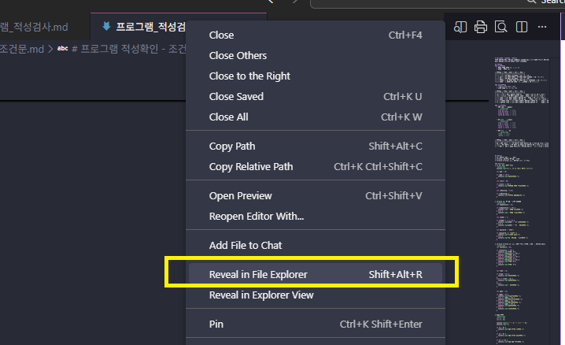
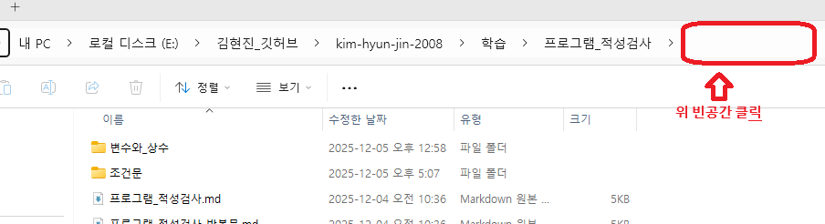
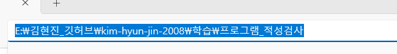
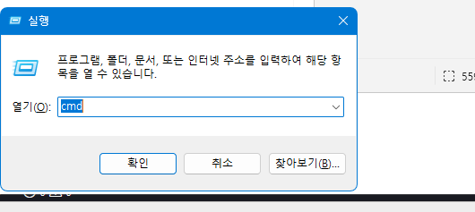
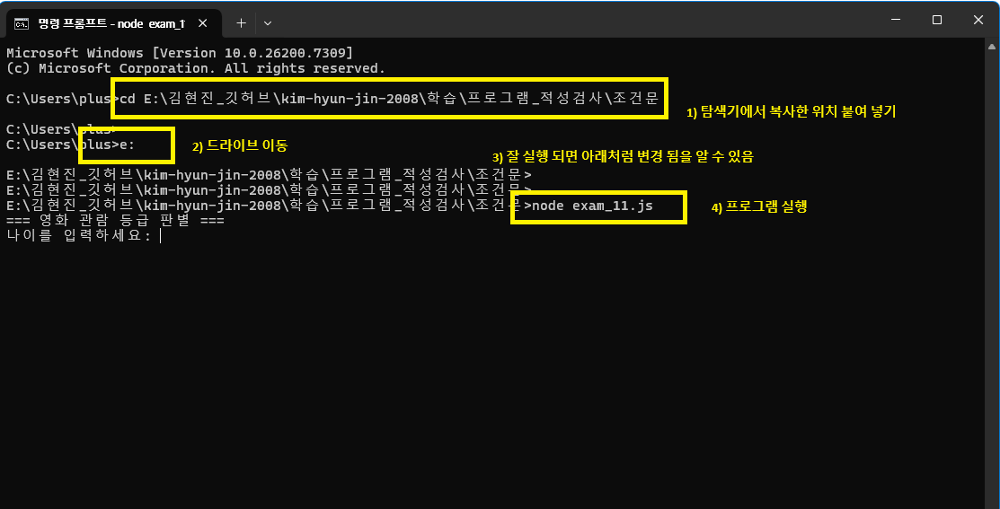

# CMD(컴앤드라인) nodeJS 실행 방법
```
작성자: 김재용
작성일: 2025.12.05
위  치: E:\김현진_깃허브\kim-hyun-jin-2008\학습\프로그램_적성검사\cmd_nodejs_실행방법
```

## 실행 방법
vscode의 터미널을 통한 방법과 별도의 cmd 창을 띄워서 하는 방법이 있는데 여기서는 별도의 cmd 창을 띄우는 방법에 대해 설명 합니다.

### 1) 프로그램이 있는 디렉토리를 탐색기로 열기
* 위치는 각자 사용하는 PC에 따라 모두 다르며 반드시 아래 위치에 있는것은 아닙니다.
* 정확한 위치는 작성하는 본인이 알고 있으며 이를 모른다면 적어 놓으세요. 반드시 적어 놓고 사용하면 됩니다.
* 예전에 흔히 말한 '적자생존' 지금도 통합니다. 기억이 안나다. 모르겠다. 다시말해 주면 안돼냐 그러지 마세요.
* 적어 놓으면 아쉬운 소리 할 필요가 없습니다.



---

### 2) 탐색기에서 주소 복사
Alt + D 키를 이용해서 선택하거나 아래 이미지 처럼 빈공간을 클릭하면 복사 할 수 있습니다.


<br><br>

---

### 3) 위치 복사하기
Alt + C 단축키를 이용해서 복사 합니다.


<br><br>

---

### 4) cmd 실행
윈도우키 + R 단축키 활용 하거나 작업표시줄에 아이콘이 있으면 클릭 하면 되는데 아래 5번과 같은 컴랜드라인 창이 떠 있으면 됩니다.


<br><br>

---

### 5) 디렉토리 이동 및 nodejs 실행
* 복사한것을 붙여 넣습니다. Shift + Insert
* 드라이브 이동을 합니다. 아래는 E: 이지만 본인이 복사한 곳에 보면 디렉토리 명칭이 있으니 그것을 이용
* 잘 이동 되었는지 확인합니다. 프롬프트 부분이 위치에 맞게 변경 되어 있습니다. cd 엔터를 치면 현재 경로가 나옵니다.
* nodejs 파일명.js 형태로 실행


<br><br>

